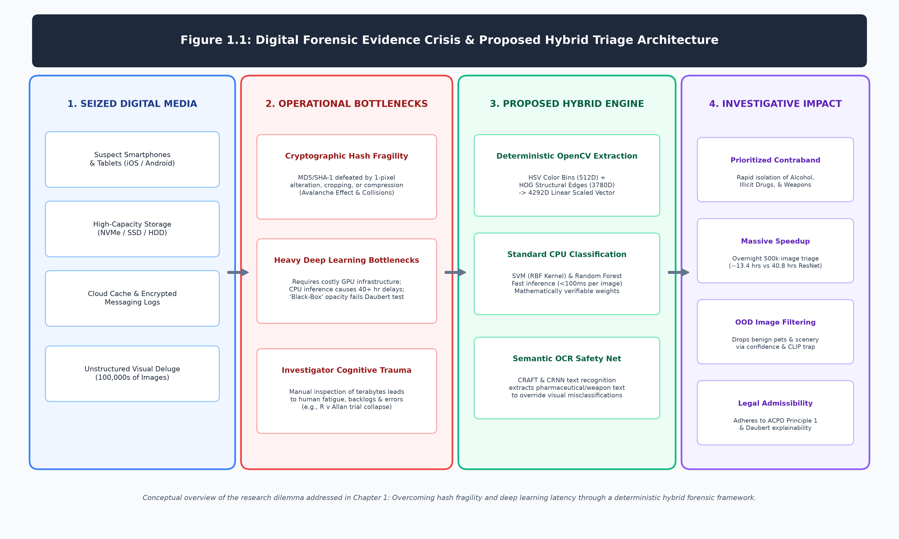

# Chapter 1: Introduction

## 1.1 Background to the Study
Digital forensic investigators today operate on the front lines of an escalating data crisis. In the modern era of ubiquitous smart devices, terabyte-sized hard drives, and cloud synchronization, the volume of digital evidence seized during a routine criminal investigation is staggering. Finding a critical piece of visual evidence—such as an image of illegal narcotics, an unlicensed firearm, or a forged financial document—often resembles searching for a needle in a digital haystack.

The theoretical foundation of this triage process is deeply rooted in Locard's Exchange Principle. Edmond Locard, a pioneer in forensic science, postulated the fundamental maxim: *"Every contact leaves a trace"* (Locard, 1930). In the physical realm, this manifests as DNA, fibers, or fingerprints left at a crime scene. In the contemporary digital theater, Locard's principle translates to digital artifacts. Every time a suspect interacts with a computer network, downloads an illicit image, or communicates via an encrypted messaging application, they inevitably leave a mathematical trace within the system's registry, unallocated space, or file system metadata. The critical challenge facing modern investigators is no longer finding the trace itself, but mathematically isolating that singular, microscopic trace from the overwhelming terabytes of benign background data generated by modern operating systems.

Historically, forensic teams have relied heavily on manual inspection combined with cryptographic hash-matching techniques to identify illicit files. Hash matching algorithms, such as Message Digest 5 (MD5) and Secure Hash Algorithm 1 (SHA-1), generate a unique alphanumeric string (a "digital fingerprint") for a seized file. This fingerprint is then rapidly queried against massive databases of known illicit material, such as the National Software Reference Library (NSRL). While computationally efficient, this methodology is inherently fragile. Cryptographic hashes are designed to be extremely sensitive to the slightest alteration (the avalanche effect). If a suspect crops an image by a single pixel, applies a minor compression filter, or even strips the EXIF metadata, the resulting hash value changes completely, and the automated match fails. 

Furthermore, the cryptographic security of these legacy algorithms has been fundamentally compromised; MD5 has been vulnerable to practical collision attacks since 2004, and the 2017 "SHAttered" attack by Google and CWI Amsterdam definitively proved that two distinct files could produce the exact same SHA-1 hash (Stevens et al., 2017). As suspects increasingly use anti-forensic techniques to manipulate files and evade hash detection, investigators are forced to fall back on manual inspection. This manual review process is painfully slow, financially costly, and exposes human analysts to severe cognitive fatigue and psychological trauma when forced to review explicit or disturbing content for hours on end.

Recently, the academic community has heavily promoted deep learning—specifically Convolutional Neural Networks (CNNs)—as the modern solution to this backlog. However, these advanced neural networks come with significant, often prohibitive, drawbacks for typical law enforcement agencies. Deep learning models require massive datasets for training, suffer from a profound lack of legal interpretability (the "black-box" problem), and demand expensive, enterprise-grade Graphical Processing Units (GPUs) to execute inference efficiently.

The consequences of this technological backlog are not merely theoretical; they have manifested in highly publicized, catastrophic legal failures. A prominent historical example is the 2017 case of *R v Allan* (Crown Prosecution Service, 2018), where a rape trial in the UK collapsed entirely because digital forensic analysts, overwhelmed by the sheer volume of data, failed to process a critical cache of 40,000 text messages in a timely manner. The delayed discovery of exculpatory evidence not only ruined the trial but fundamentally damaged public trust in the forensic triage process. When forensic laboratories are mathematically incapable of processing data at the speed it is generated, justice is invariably delayed or entirely denied. This reality underscores the absolute necessity for rapid, automated, and mathematically verifiable triage mechanisms.

As a highly pragmatic alternative, classical computer vision techniques powered by deterministic mathematical algorithms offer a robust, explainable, and computationally lightweight approach. By extracting predefined structural geometries (such as the Histogram of Oriented Gradients, or HOG; Dalal and Triggs, 2005) and global color distributions, investigators can rapidly filter and categorize datasets directly on standard CPU hardware. However, both deep learning and classical algorithms remain vulnerable to visual biases—such as misclassifying a brown glass bottle of medicine as alcohol. To truly resolve these limitations, modern forensic triage must evolve into a hybrid system, combining the speed of structural computer vision with the semantic understanding of Optical Character Recognition (OCR) to perform fast, highly accurate, and legally defensible evidence triage.

Figure 1.1 conceptualizes the end-to-end problem space and architectural response explored in this dissertation. It visually contrasts the operational crisis of seized digital media against the vulnerabilities of legacy cryptographic hashing (avalanche sensitivity and collision risks), the manual triage backlog, and the heavy GPU overhead of deep neural networks. In response, it illustrates the proposed hybrid triage engine, which pairs deterministic OpenCV feature extraction with a semantic OCR safety net to achieve rapid, auditable evidence triage on frontline CPU workstations.

## 1.2 Motivation for the Research
This research is driven by the urgent operational need to resolve the severe inefficiencies plaguing modern forensic image analysis, without introducing the prohibitive hardware costs and legal opacity associated with deep learning. 

Digital Incident Response teams and local law enforcement agencies operate under strict time constraints and tight budgets. They cannot afford to waste weeks manually clicking through hundreds of thousands of benign images (such as family vacation photos or OS system files) to find a single piece of evidence. Conversely, they rarely possess the financial resources to purchase high-end GPU clusters required to run modern deep learning architectures natively.

By engineering a reliable, automated triage system powered by classical computer vision pipelines, this project seeks to streamline the initial, most time-consuming phase of an investigation. A fast, highly deterministic classification tool that operates locally on standard investigative laptops will drastically reduce the manual workload, empowering investigators to triage evidence in hours rather than weeks, thereby accelerating the pursuit of justice and alleviating the immense psychological burden on human analysts.

## 1.3 Aims and Objectives
The primary aim of this project is to design, implement, and rigorously evaluate a deterministic computer vision framework capable of rapidly triaging and classifying forensic images, specifically optimized for the hardware constraints of standard forensic workstations.

To achieve this aim, the research is guided by the following specific objectives:
1. **Dataset Engineering:** Gather, curate, and normalize a specialized dataset of digital images representing common forensic evidence categories (Alcohol, Drugs, and Weapons), introducing real-world "noise" to ensure robust model training.
2. **Classical Feature Extraction:** Build a computationally efficient pre-processing pipeline utilizing OpenCV to extract mathematically deterministic features, specifically 3D Color Histograms and Histogram of Oriented Gradients (HOG) structural descriptors.
3. **Machine Learning Implementation:** Train three distinct classical machine learning algorithms (Support Vector Machine, Random Forest, and K-Nearest Neighbors) using the engineered 4292-dimensional feature vectors to accurately triage the image dataset.
4. **Baseline Comparison:** Evaluate the classical OpenCV pipeline against three heavyweight Deep Learning baselines (ResNet-50, VGG-16, and MobileNetV3-Large), explicitly comparing statistical classification accuracy against CPU inference latency.
5. **Hybrid Semantic Integration:** Design and integrate a Hybrid Semantic OCR safety net (utilizing `easyocr`) to explicitly extract critical textual evidence (e.g., pharmaceutical labels, weapon branding) to override erroneous visual predictions and minimize false negatives.
6. **Deployment:** Synthesize the algorithms into a deployable, transparent triage dashboard application capable of executing locally on standard forensic hardware without cloud dependencies.

## 1.4 Structure of the Dissertation
To present this research logically, the remainder of the dissertation is structured as follows:
* **Chapter 2 (Literature Review):** Critically evaluates the current state of digital forensics, contrasting the proven limitations of cryptographic hashing against the computational constraints of deep learning, establishing the need for deterministic computer vision.
* **Chapter 3 (Design):** Outlines the mathematical foundation and experimental setup of the research, detailing the dataset curation, the HOG and Color Histogram feature extraction mathematics, and the configuration of the deep learning baselines.
* **Chapter 4 (Implementation):** Describes the practical application of the designed methodology, including the construction of the classical computer vision pipeline and the integration of the Hybrid Semantic OCR safety net.
* **Chapter 5 (Evaluation):** Presents the empirical findings of the study. It critically analyzes the performance, precision, and CPU inference latency of the classical pipeline against the neural network baselines, ultimately evaluating the core research hypothesis.
* **Chapter 6 (Conclusion):** Summarizes the practical impacts of the hybrid triage system, acknowledges its inherent limitations, and proposes actionable avenues for future development, such as edge-device deployment.
