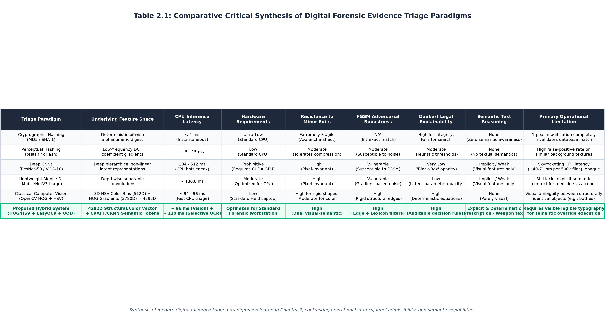

# Chapter 2: Literature Review
    
## 2.1 Introduction
The landscape of digital forensics has undergone a profound transformation over the past two decades. As the digital footprint of modern criminal activity has expanded exponentially, law enforcement agencies have found themselves overwhelmed by a deluge of digital evidence. The transition from physical evidence collection to digital data triage has necessitated the development of automated, highly scalable methodologies capable of rapidly identifying illicit materials, such as unregulated narcotics, illegal firearms, and explicit imagery. This chapter critically evaluates the academic and professional literature surrounding automated digital forensic triage. It systematically unpacks the historical reliance on cryptographic hash matching, analyzes the rise and subsequent operational limitations of modern deep learning architectures, and ultimately constructs the theoretical foundation for returning to deterministic, classical computer vision techniques augmented by semantic safety nets.

## 2.2 The Fragility of Cryptographic Hash Matching in Forensics
For nearly two decades, the cornerstone of automated digital forensic analysis has rested entirely on cryptographic hash functions. A cryptographic hash function operates by ingesting an input file of arbitrary size and generating a fixed-size, deterministic alphanumeric string, effectively acting as a unique digital fingerprint. Within standard forensic investigations, algorithms such as Message Digest 5 (MD5) and Secure Hash Algorithm 1 (SHA-1) have been universally adopted to rapidly compare seized files against massive, centralized databases of known illicit material, such as the National Software Reference Library (NSRL) maintained by the United States government.

While hash matching is computationally lightning-fast and universally accepted in courts of law as a means of verifying evidence integrity (chain of custody), it suffers from a fatal vulnerability when deployed as an investigative search tool: the avalanche effect. Cryptographic hashes are intentionally designed so that the slightest alteration to the input data results in a completely disparate hash value. If a suspect maliciously, or even accidentally, alters a single pixel, subtly crops an image, changes the file compression ratio, or simply strips the EXIF metadata using standard social media platforms, the resulting hash value changes completely. Because sophisticated offenders frequently manipulate illegal files to deliberately avoid automated database detection, rigid hash matching alone is no longer scientifically sufficient to triage modern visual evidence.

Furthermore, the foundational security of legacy hashing algorithms has been categorically compromised in recent years. MD5 has been scientifically proven to be highly susceptible to practical collision attacks since 2004, meaning malicious actors can intentionally craft two distinct files that produce the exact same MD5 hash value. Similarly, SHA-1 was proven cryptographically broken in 2017 when researchers from Google and CWI Amsterdam published the "SHAttered" attack, successfully demonstrating a practical, calculated SHA-1 collision. The existence of these collision vulnerabilities introduces severe legal complications in the courtroom; if defense counsel can prove that a hashing algorithm is no longer mathematically collision-resistant, the foundational integrity of the digital evidence can be successfully challenged. Because of this extreme fragility and legacy vulnerability, forensic analysts are increasingly forced to abandon automated hashing algorithms in favor of manual, human inspection—an agonizingly slow process that exposes investigators to severe cognitive fatigue and psychological trauma when dealing with disturbing content.

### 2.2.1 ACPO Guidelines and the Legal Mandate for Hash Integrity
Within the United Kingdom, the handling of digital evidence is stringently governed by the Association of Chief Police Officers (ACPO) Good Practice Guide for Digital Evidence (frequently maintained in conjunction with the National Police Chiefs' Council, NPCC) (ACPO, 2012). The ACPO guidelines establish four core principles for digital forensics, the most critical being Principle 1: "No action taken by law enforcement agencies or their agents should change data held on a computer or storage media which may subsequently be relied upon in court."

To mathematically prove adherence to Principle 1, forensic investigators rely exclusively on cryptographic hashes. An MD5 or SHA-1 hash is generated at the exact moment a hard drive is seized (the "pre-imaging" hash). After forensic cloning, a second hash is generated from the clone. If the two hashes match perfectly, the chain of custody is legally preserved, proving the data was not altered. 

However, a critical legal paradox arises when investigators attempt to use these same hashing algorithms as an active search mechanism (e.g., comparing seized files against a database of known contraband). While a hash perfectly proves a file has not been altered by the *police*, it completely fails to identify illegal files that have been subtly altered by the *suspect*. If an offender downloads a known illegal image and slightly alters the contrast or resizes the image by a single pixel, the visual content remains identical and highly illegal, but the cryptographic hash changes entirely. This renders database queries useless. The inability of hashing algorithms to understand "semantic similarity" rather than "exact bit-for-bit duplication" is the primary catalyst driving the academic pivot toward intelligent computer vision in modern forensics.

## 2.3 The Deep Learning Revolution in Computer Vision
To overcome the severe, pixel-perfect limitations of signature-based matching, the academic community aggressively pivoted toward machine learning, specifically the sub-field of deep learning. Convolutional Neural Networks (CNNs) gained immense popularity because they possess the unique mathematical ability to automatically learn complex, hierarchical visual features directly from raw pixel data. Unlike hash functions, a CNN completely ignores minor changes in file metadata or pixel compression, focusing instead on the actual visual semantics of the image.

The deep learning revolution in computer vision truly began in 2012 with the introduction of AlexNet (Krizhevsky et al., 2012), which demonstrated unprecedented accuracy on the ImageNet challenge by utilizing deep convolutional layers and Rectified Linear Unit (ReLU) activations. This was rapidly followed by deeper, more uniform architectures such as VGG-16 (Simonyan and Zisserman, 2014), which utilized highly structured $3 \times 3$ convolution filters to extract incredibly dense feature maps. Eventually, the vanishing gradient problem—which historically prevented neural networks from scaling to extreme depths—was solved by the introduction of ResNet (Residual Networks) in 2015 (He et al., 2016). ResNet introduced "skip connections," allowing gradients to bypass certain layers during backpropagation, enabling the training of networks that were dozens, or even hundreds, of layers deep.

Recent empirical studies into automated evidence processing have directly demonstrated the efficacy of this paradigm shift; for instance, Del Mar-Raave et al. (2021) developed a machine learning-based forensic tool for image classification adopting a design science approach, proving that automated visual categorization can drastically alleviate investigator backlogs compared to traditional manual review. Numerous academic studies have further demonstrated that architectures like ResNet-50 and VGG-16 can achieve remarkably high accuracy rates when identifying complex forensic objects, such as concealed weapons or specific narcotic packaging. However, attempting to transition these theoretical deep learning successes from pristine academic laboratories into the chaotic reality of local digital forensic units has introduced a host of massive operational hurdles.

## 2.4 The Operational and Legal Hurdles of Deep Learning in Digital Forensics

### 2.4.1 Data Scarcity and Forensic Privacy Constraints
Deep learning models are notoriously data-hungry; they require massive, highly diverse, and meticulously labeled datasets to perform reliably and generalize to unseen data. In the realm of digital forensics, acquiring millions of labeled illicit images is practically, legally, and ethically impossible. Strict privacy laws (such as GDPR), court-mandated access restrictions, and the highly sensitive nature of criminal evidence (such as Child Sexual Abuse Material or confidential financial records) strictly prohibit the open-source sharing of authentic forensic datasets.

Consequently, forensic deep learning models are often trained on severely limited, imbalanced, and synthesized datasets. When deployed in the field, these models frequently suffer from severe overfitting, failing catastrophically when presented with new, evolving forms of visual evidence that deviate slightly from their highly constrained training distributions.

### 2.4.2 Dataset Bias, Ethics, and Algorithmic Fairness
The scarcity of representative forensic data invariably leads to algorithmic bias—a critical ethical failing that has severely tarnished the reputation of AI within the criminal justice system. If a neural network is disproportionately trained on images of illicit drugs seized from a specific socioeconomic demographic, the model will inadvertently learn to associate the background environments (e.g., specific types of carpet, lighting, or furniture common in lower-income housing) with criminality. When deployed, the model will systematically generate false positives against that specific demographic, while potentially missing illicit materials photographed in affluent environments.

This phenomenon, frequently referred to as "demographic parity failure" or "algorithmic redlining," is scientifically well-documented in other law enforcement AI domains, most notably facial recognition. In facial recognition algorithms, networks trained predominantly on Caucasian faces have demonstrated unacceptably high false-positive identification rates when evaluating individuals of color, leading to wrongful arrests. 

While object classification (e.g., identifying a handgun) is ostensibly less susceptible to racial bias than facial recognition, the underlying mathematical risk of environmental bias remains severe. Because Deep Learning models (CNNs) learn holistic, abstract representations of the entire image (including the background), they are highly vulnerable to learning these biased environmental correlations. Classical models, particularly those utilizing the Histogram of Oriented Gradients (HOG), naturally mitigate this ethical risk. Because HOG strictly evaluates the rigid structural geometry of the *foreground object* (the edges of the gun or the bottle) and aggressively discards unstructured background textures, it is mathematically incapable of learning biased environmental correlations. Consequently, transitioning back to deterministic classical algorithms not only solves the computational latency crisis but provides a much stronger ethical foundation for deploying AI in an equitable, unbiased criminal justice system.

### 2.4.3 Computational Overhead and Hardware Limitations
Perhaps the most significant pragmatic barrier to adopting deep learning in active law enforcement is the immense computational overhead required to execute it. Training state-of-the-art CNNs, and even executing inference on large batches of seized files, demands significant computational power—specifically, expensive, enterprise-grade Graphics Processing Units (GPUs). 

Many deep learning models are fundamentally "over-parameterized," possessing more internal mathematical weights than there are data points to train them on. The stark reality of local law enforcement is that standard digital forensic laboratories and frontline field investigators simply do not possess the municipal budget or the hardware infrastructure to execute heavy PyTorch or TensorFlow models natively. Investigators are typically issued standard, CPU-bound laptops. When heavy CNNs are forced to run inference on a CPU, the processing latency skyrockets, transforming a rapid triage operation into a multi-day bottleneck.

### 2.4.4 The "Black-Box" Interpretability Crisis and Legal Admissibility
Finally, deep learning introduces a critical, often insurmountable legal barrier: a severe lack of interpretability. A major prerequisite for utilizing any automated software in legal proceedings (often governed by the Daubert Standard in the United States or the equivalent reliability standards in the UK) is that the evidence it produces must be explainable, transparent, and scientifically validated. 

Deep neural networks inherently act as a "black box." While they provide a final classification prediction, the complex web of millions of floating-point mathematical weights makes it nearly impossible for a human analyst to transparently explain *how* the model arrived at that specific decision. If a model flags a perfectly benign image as a weapon, the investigator cannot easily debug the neural pathway to determine why. In a court of law, opaque AI decision-making can and will be heavily scrutinized by opposing experts, potentially undermining the credibility of the entire forensic investigation.

### 2.4.5 Adversarial Machine Learning and the FGSM Vulnerability
Beyond the inherent interpretability crisis, deep learning architectures introduce a severe, scientifically verifiable security vulnerability: susceptibility to Adversarial Machine Learning. Because CNNs learn abstract, non-linear feature representations, they can be intentionally deceived by mathematically engineered noise that is completely imperceptible to the human eye.

The most prominent example is the Fast Gradient Sign Method (FGSM). Proposed by Goodfellow et al. (2014), FGSM operates by calculating the gradient of the neural network's loss function with respect to the input image pixels. The algorithm then intentionally adds a microscopic perturbation to the image in the exact direction that maximizes the network's classification error. 

Mathematically, the adversarial image $x'$ is generated using the equation:
$$x' = x + \epsilon \cdot \text{sign}(\nabla_x J(\theta, x, y)) \quad (2.1)$$
Where $x$ is the original image, $y$ is the true label, $J$ is the loss function, $\theta$ represents the model weights, and $\epsilon$ is a remarkably small multiplier ensuring the noise remains invisible to humans.

In a forensic context, a sophisticated offender could run an FGSM script over their illegal image cache. The images would look perfectly normal to a human investigator, but an automated ResNet-50 or VGG-16 triage model would confidently classify the weapons or illicit drugs as completely benign objects (e.g., classifying a handgun as a "toaster"). Because classical algorithms like the Histogram of Oriented Gradients (HOG) rely on rigid, macro-level structural geometry rather than highly abstract, non-linear pixel representations, they are substantially more resistant to these microscopic adversarial pixel perturbations, offering a more robust security posture for legal triage.

### 2.4.6 Legal Admissibility: The Daubert and Frye Standards
The culmination of the interpretability crisis and adversarial vulnerability directly threatens the legal admissibility of deep learning evidence. In jurisdictions governed by the Frye Standard (*Frye v. United States*, 1923), scientific evidence must be "generally accepted" by the relevant scientific community. However, in jurisdictions adhering to the more stringent Daubert Standard (*Daubert v. Merrell Dow Pharmaceuticals, Inc.*, 1993; which heavily influences international courts), the admissibility of expert evidence relies on specific criteria: the technique must be empirically testable, subjected to peer review, possess a known error rate, and have standardized operational controls.

When an investigator utilizes a black-box CNN to triage evidence, defense attorneys can aggressively leverage the Daubert criteria. If the investigator cannot mathematically explain *how* the neural network recognized a weapon, cannot guarantee immunity from adversarial FGSM attacks, and cannot define the explicit feature boundaries, the triage software risks being ruled inadmissible. Classical computer vision models, conversely, easily satisfy the Daubert standard. An investigator can explicitly testify that a HOG SVM identified a weapon because the software calculated a specific gradient magnitude along the rigid, metallic edge of the object, providing a transparent, reproducible, and legally defensible justification.

## 2.5 Classical Computer Vision: A Return to Determinism
Due to the profound financial, computational, and legal limitations of deep neural networks, the academic and professional forensic communities have witnessed a renewed, highly pragmatic interest in classical computer vision techniques, powered by robust, highly optimized libraries such as OpenCV. 

Instead of relying on automated, opaque feature learning, classical computer vision relies on explicitly defined, deterministic mathematical algorithms to extract specific visual characteristics from an image.

### 2.5.1 SIFT, SURF, and the Evolution of Descriptors
Early classical computer vision relied heavily on keypoint detectors such as the Scale-Invariant Feature Transform (SIFT; Lowe, 2004) and Speeded-Up Robust Features (SURF; Bay et al., 2006). SIFT revolutionized the field by detecting distinct points within an image and generating descriptors that were highly invariant to scaling, rotation, and illumination changes (Lowe, 2004). However, SIFT was notoriously computationally expensive and heavily burdened by proprietary patents for many years. SURF attempted to resolve the speed issues using Haar wavelet responses (Bay et al., 2006), but remained computationally heavier than what modern rapid triage demands.

### 2.5.2 Histogram of Oriented Gradients (HOG): Capturing Structural Geometry
While keypoint detectors excel at finding distinct corners, capturing the holistic geometric shape of an object (like a firearm or a syringe) requires a more structural approach. The Histogram of Oriented Gradients (HOG) algorithm, popularized in 2005 for pedestrian detection, evaluates the occurrences of gradient orientations in localized portions of an image. 

By dividing an image into small connected regions (cells) and compiling a histogram of gradient directions (changes in pixel intensity) for the pixels within each cell, HOG mathematically maps the rigid structural outline of an object, entirely disregarding its color or internal texture (Dalal and Triggs, 2005). HOG is exceptionally robust, completely patent-free, and computationally cheap enough to run blazingly fast on standard CPUs, making it a cornerstone of classical shape detection in forensics.

### 2.5.3 Color Space Analysis
While structural geometry is critical, illicit materials often exhibit highly distinct color profiles. For instance, specific brands of prescription medication or standard illicit packaging rely heavily on distinct color palettes. Standard Red-Green-Blue (RGB) color spaces are highly susceptible to lighting changes (shadows or overexposure). Consequently, modern classical pipelines frequently utilize the Hue, Saturation, Value (HSV) color space, which mathematically separates the actual color pigment (Hue) from the environmental lighting conditions (Value). By extracting a multi-dimensional HSV Color Histogram, investigators can rapidly filter evidence based on global color distributions without triggering the heavy processing costs of neural networks.

## 2.6 The Synthesis of Semantic OCR and Hybrid Pipelines
A critical, documented limitation of both traditional Deep Learning and Classical Computer Vision is their rigid adherence to pixel-level patterns, which inevitably manifests as severe visual bias. For instance, a classical model trained heavily on the geometric shape and color of brown beer bottles may systematically, and erroneously, classify any brown, cylindrical object—such as a wooden weapon handle or a bottle of benign medical syrup—as alcohol.

To resolve this visual bias, modern forensic literature highly advocates for the adoption of hybrid methodologies that incorporate explicit semantic intelligence. Images containing illicit materials frequently feature highly deterministic contextual clues that purely visual models completely ignore: embedded text. Examples include pharmaceutical labels, chemical formulas printed on illicit packaging, or specific serial numbers etched into the slide of a handgun.

Optical Character Recognition (OCR)—powered by modern deep architectures such as Character Region Awareness for Text Detection (CRAFT; Baek et al., 2019) and Convolutional Recurrent Neural Networks (CRNN; Shi et al., 2016)—has recently emerged as a critical semantic safety net within hybrid forensic pipelines. By integrating a highly optimized OCR engine alongside the primary visual classifiers, a triage system can extract textual evidence in real-time. If the primary vision model incorrectly classifies an image of codeine syrup as standard alcohol, the OCR engine can read the explicit word "prescription" or "codeine" and forcefully, transparently override the erroneous visual prediction.

### 2.6.1 Comparative Synthesis of Triage Paradigms
To critically contextualize the operational, hardware, and legal parameters evaluated across the literature, Table 2.1 synthesizes the core triage methodologies reviewed in this chapter.

As demonstrated in Table 2.1, conventional methodologies force an unacceptable compromise: cryptographic hashing offers microsecond speed but is disabled by single-pixel alterations, while heavyweight CNNs offer visual invariance at the cost of crippling CPU inference latency and "black-box" legal vulnerability under the Daubert standard. The deterministic hybrid framework engineered in this research resolves this historical impasse by coupling lightweight HOG/HSV computer vision with an explicit OCR semantic safety net.

## 2.7 Summary
An exhaustive review of the current literature highlights the fundamental trade-offs defining modern digital forensics:
1.  **Cryptographic hashing** (MD5/SHA-1) is fast but mathematically fragile, vulnerable to intentional collisions, and easily defeated by minor file modifications.
2.  **Deep Learning** (CNNs) provides exceptional visual accuracy but is computationally prohibitive on standard field hardware, requires legally scarce datasets, and suffers from a lack of legal explainability in court.
3.  **Classical Computer Vision** (HOG/HSV features) offers a legally transparent, computationally lightweight, and highly pragmatic alternative that can run locally on standard CPU hardware, provided the engineered features are mathematically robust.

To effectively eliminate the severe backlog plaguing modern digital forensic laboratories, researchers must synthesize the sheer CPU processing speed of deterministic classical algorithms with the semantic safety nets of Optical Character Recognition, offering a pragmatic, highly accurate, and legally defensible solution for the rapid triage of visual evidence.
