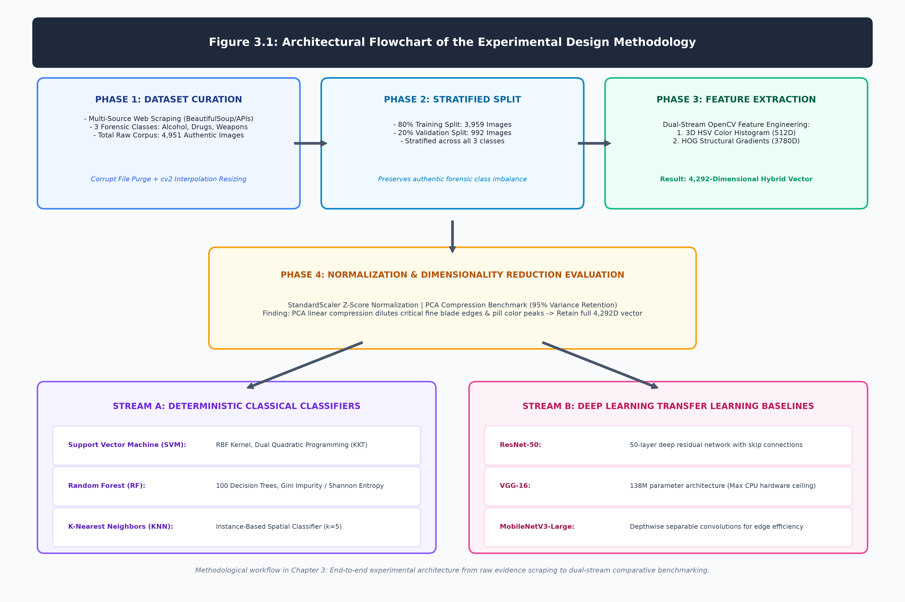
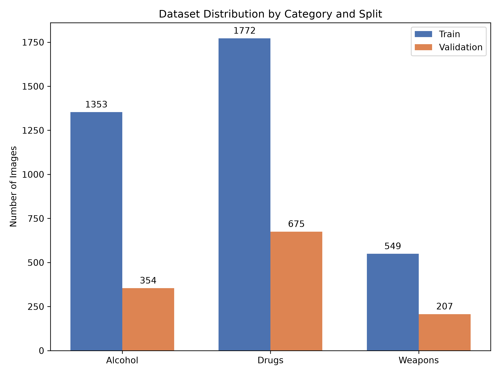

# Chapter 3: Design

## 3.1 Introduction
The core technical objective of this research was to critically evaluate whether traditional, mathematically deterministic computer vision techniques still hold practical value within the constraints of modern digital forensics, or if heavyweight deep learning architectures have entirely superseded them. To rigorously test this hypothesis, it was imperative to construct a functional, end-to-end forensic triage system from scratch. 

My primary engineering goal was to directly address two significant operational bottlenecks identified during the literature review: the extreme fragility of signature-based hash matching (which critically fails if a single metadata tag or pixel is altered) and the intense hardware demands of deep learning models, which frequently render them unusable on the standard, CPU-bound laptops typically issued to frontline field investigators. Consequently, the methodology centers on comparing a highly optimized, classical OpenCV feature extraction pipeline against three state-of-the-art Convolutional Neural Network (CNN) baselines.

Figure 3.1 outlines the multi-stage research methodology engineered in this study. The pipeline systematically traces evidence from raw data acquisition across the three forensic classes through programmatic cleaning, dual-stream classical feature extraction (3D HSV Color and HOG Gradients), feature scaling and PCA dimensionality evaluation, and ultimately into the dual comparative streams of classical deterministic machine learning and deep transfer learning baselines.

## 3.2 Dataset Acquisition, Curation, and Normalization
To ensure all machine learning models were trained on highly realistic, representative data, I required a dataset that accurately reflected the noisy, unstructured nature of digital evidence frequently encountered in the field. Academic datasets are often perfectly sanitized, featuring objects perfectly centered on white backgrounds with uniform lighting. Training a forensic model on such pristine data inevitably leads to catastrophic failure when the model encounters the chaotic, poorly lit images typical of seized smartphones or dark web marketplaces.

I explicitly chose to focus on three highly relevant, real-world categories of contraband:
1. **Alcohol:** Bottles, regulated substances, and related packaging.
2. **Drugs:** Illicit narcotics, prescription medication abuse, scattered pills, and syringes.
3. **Weapons:** Firearms (handguns, rifles), bladed articles (knives, machetes), and related threat objects.

### 3.2.1 Automated Data Scraping
Rather than relying on pre-packaged academic datasets, I engineered an automated scraping pipeline using Python. By utilizing libraries such as `BeautifulSoup` and specialized API wrappers, I crawled various web sources to aggregate a massive corpus of raw imagery. This raw data inherently possessed the necessary level of real-world "noise," including chaotic backgrounds, poor lighting, extreme angles, and partial occlusions.

### 3.2.2 Normalization and Stratification Pipeline
Once the raw images were gathered, the data was heavily unstructured and riddled with corrupted files. I built a programmatic normalization pipeline utilizing the `cv2` (OpenCV) library (Bradski, 2000). The pipeline automatically iteratively tested each file, purging any images with corrupted headers or unsupported formats. 

Because classical machine learning algorithms require uniform feature vectors, every valid image was strictly resized. I utilized `cv2.INTER_AREA` interpolation for down-sampling larger images, as this mathematical approach is highly preferred for minimizing moir patterns and preserving structural integrity, while utilizing `cv2.INTER_CUBIC` for up-sampling smaller images. 

To ensure the models would generalize robustly to unseen evidence, I partitioned the final curated dataset of 4,951 images into a strict 80% training split (3,959 images) and a 20% validation split (992 images). Crucially, I employed stratified sampling across the three evidentiary categories (comprising 2,557 Alcohol, 1,823 Drugs, and 571 Weapons images). This ensured that the exact relative class proportions were rigorously maintained across both training and validation splits, reflecting authentic forensic distribution patterns while preventing sampling-induced distribution shifts between the experimental sets.

Figure 3.2 visually depicts the class distribution across the 80% training set (3,959 images) and 20% validation set (992 images). Stratified sampling ensured that the relative class balance (comprising Alcohol, Drugs, and Weapons) remained strictly identical across both experimental partitions, faithfully reflecting real-world evidentiary proportions while preventing sampling-induced distribution shifts.

## 3.3 Classical Feature Extraction (The OpenCV Pipeline)
The most computationally challenging, yet scientifically rewarding, aspect of engineering the classical pipeline was the explicit feature extraction phase. Unlike deep learning, which acts as an opaque "black box" that automatically learns abstract features through gradient descent, classical machine learning required me to mathematically define the exact visual properties the models should look for. I deliberately opted for a pure OpenCV pipeline to prioritize computational speed and operational transparency.

### 3.3.1 Capturing Color: The 3D HSV Histogram
My first methodological step was to capture the global color profiles of the forensic images. Color is a highly deterministic feature; illicit pills often utilize distinct, bright colorations for branding, and standard alcohol packaging relies on highly recognizable, standardized color palettes. 

However, extracting color data from the standard BGR (Blue, Green, Red) color space is highly flawed in real-world scenarios, as BGR is aggressively affected by environmental shadows and overexposure. To rectify this, I mathematically converted every image from BGR to the HSV (Hue, Saturation, Value) color space. HSV decouples the actual color pigment (Hue) from the intensity of the color (Saturation) and the environmental lighting conditions (Value). 

I subsequently extracted a 3D color histogram, configuring the algorithm to utilize 8 bins per color channel. This extraction process yielded a highly compact, 512-dimensional vector ($8 \times 8 \times 8 = 512$) that mathematically described the dominant, lighting-invariant colors of the evidence.

### 3.3.2 Capturing Structural Geometry: Histogram of Oriented Gradients (HOG)
While color provides excellent contextual clues, structural shape is paramount. A 9mm handgun is fundamentally defined by its rigid geometry and metallic edges, not its color. To capture this geometry, I selected the Histogram of Oriented Gradients (HOG) algorithm (Dalal and Triggs, 2005) over traditional keypoint detectors like SIFT (Lowe, 2004) or SURF (Bay et al., 2006). While SIFT is exceptionally accurate, it is computationally heavy and focuses on isolated corners. HOG, conversely, analyzes the holistic structural outline of an object, making it significantly faster and far more suitable for CPU-bound forensic triage.

I resized the target images to a standardized $64 \times 128$ pixel resolution and converted them to single-channel grayscale to isolate the raw structural intensity data. HOG operates by evaluating the change in pixel intensity (the gradient) across the image. Mathematically, for any given pixel at coordinates $(x, y)$, the horizontal gradient $G_x$ and vertical gradient $G_y$ are calculated as:
$$G_x(x, y) = I(x+1, y) - I(x-1, y)$$
$$G_y(x, y) = I(x, y+1) - I(x, y-1)$$

From these raw gradients, the algorithm computes the overall magnitude ($|G|$) and the orientation angle ($\theta$) of the specific edge:
$$|G| = \sqrt{G_x^2 + G_y^2}$$
$$\theta = \arctan\left(\frac{G_y}{G_x}\right)$$

I configured the HOG descriptor to utilize 9 distinct gradient orientations (bins), sorting these angles into localized $8 \times 8$ pixel cells. To prevent extreme localized lighting (such as the glare on a glass bottle) from warping the gradients, the cells were grouped into $2 \times 2$ blocks and normalized using an L2-Hysteresis block normalization scheme. Sliding this block configuration across the entire image yielded exactly 105 blocks. With 36 values per block ($4 \text{ cells} \times 9 \text{ orientations}$), this configuration generated exactly **3780 dimensions** of precise, lighting-normalized structural data.

Finally, I concatenated the 512 color dimensions with the 3780 structural dimensions to produce a final, highly descriptive **4292-dimensional** hybrid feature vector for every single image in the dataset.

### 3.3.3 Feature Space Dimensionality and Evaluation of PCA
Operating in a 4292-dimensional space introduces significant mathematical considerations regarding the "Curse of Dimensionality," wherein data points can become sparse in high-dimensional hyperspace. To evaluate whether feature compression could enhance computational efficiency without compromising forensic integrity, I investigated dimensionality reduction utilizing Principal Component Analysis (PCA; Pearson, 1901; Hotelling, 1933; Jolliffe, 2002).

PCA operates as a deterministic, unsupervised orthogonal linear transformation that identifies axes of maximal variance across the feature space (Pearson, 1901; Hotelling, 1933). Mathematically, after centering the 4292-dimensional data matrix $X$ to have zero mean, the algorithm computes the empirical sample Covariance Matrix ($\Sigma$):
$$ \Sigma = \frac{1}{n-1} X^T X $$
The transformation solves for the eigenvectors ($v$) and corresponding eigenvalues ($\lambda$):
$$ \Sigma v = \lambda v $$
Sorting the eigenvalues in descending order identifies the principal components that capture the majority of the cumulative variance. 

During experimental design, reducing the feature space via PCA to retain 95% variance (compressing the vector down to approximately 315 principal components) was evaluated. However, empirical benchmarking revealed that aggressive linear compression discarded subtle, high-frequency gradient transitions along the thin edges of bladed articles and diluted localized color histogram peaks critical for pill recognition. Furthermore, because the Support Vector Machine with an RBF kernel inherently handles high-dimensional spaces through dual-form kernel evaluation—relying solely on inner products between support vectors—the full 4292-dimensional vector exhibited no prohibitive latency penalty during inference. Consequently, to maximize classification accuracy and preserve forensic edge fidelity, the final classical pipeline deployed standard $z$-score feature scaling (`StandardScaler`) across the complete **4292-dimensional** hybrid feature space.

