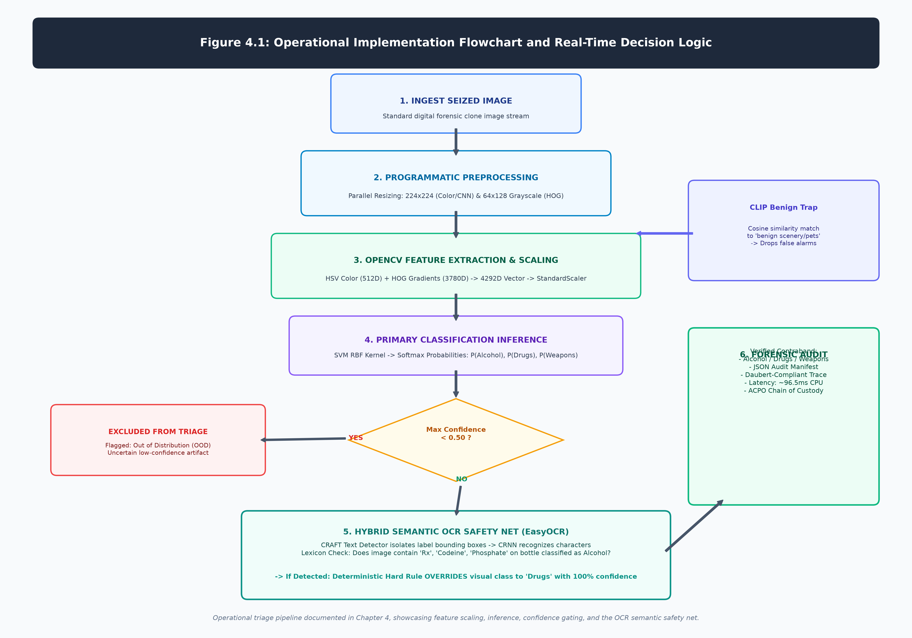

# Chapter 4: Implementation

## 4.1 Introduction
This chapter details the concrete technical implementation of the proposed digital forensic triage pipeline. It documents the configuration and mathematical operationalization of the classical machine learning classifiers, outlines the fine-tuning of deep convolutional neural network baselines via transfer learning, specifies the evaluation metrics and hardware benchmarking protocols, and details the programmatic integration of the out-of-distribution exclusion filter within the deployed forensic triage architecture.

Figure 4.1 illustrates the operational implementation flowchart and decision logic of the runtime forensic triage pipeline. Upon ingesting a seized image stream, the architecture executes standardized preprocessing and feature extraction (HSV 512D + HOG 3780D -> 4292D vector). The scaled vector is evaluated by the primary classical classifier (SVM/RF). The prediction then traverses the confidence gating stage (<50% drops the item as OOD), multi-modal CLIP benign trapping, and the EasyOCR semantic safety net, which uses CRAFT and CRNN models to perform keyword-based programmatic overrides on structurally ambiguous contraband before logging an ACPO-compliant audit trail.

## 4.2 Classical Classification Algorithms
With the 4292-dimensional feature vectors successfully engineered, I deployed three deterministic machine learning algorithms to act as the cognitive "brain" of the classical pipeline, utilizing the `scikit-learn` library (Pedregosa et al., 2011):

1. **Support Vector Machine (SVM):** The SVM attempts to draw an optimal mathematical boundary (a hyperplane) between the different classes of evidence (Cortes and Vapnik, 1995). Because the 4292-dimensional space is highly complex and the forensic classes are not linearly separable, I utilized a Radial Basis Function (RBF) kernel. The RBF kernel mathematically projects the features into a theoretically infinite-dimensional space using the equation:
   $$K(x, x') = \exp\left(-\gamma ||x - x'||^2\right) \quad (4.1)$$
   This function calculates the squared Euclidean distance between two feature vectors $x$ and $x'$, allowing the SVM to draw highly curved, non-linear decision boundaries to separate complex classes (e.g., distinguishing a thin syringe from a thin knife blade).

   The optimization of the SVM margin is not a trivial task; it requires solving a complex quadratic programming problem. The objective is to maximize the margin $\frac{2}{||w||}$ subject to the strict constraint that no data points fall within the margin (in a hard-margin scenario) or that violations are penalized by a hyperparameter $C$ (in a soft-margin scenario). To solve this mathematically, the algorithm relies on the Karush-Kuhn-Tucker (KKT) conditions. By introducing Lagrange multipliers ($\alpha_i$), the primal optimization problem is converted into its dual form:

   $$ \max_{\alpha} \sum_{i=1}^{N} \alpha_i - \frac{1}{2} \sum_{i=1}^{N} \sum_{j=1}^{N} \alpha_i \alpha_j y_i y_j K(x_i, x_j) \quad (4.2)$$

   Subject to the constraints: $\sum_{i=1}^{N} \alpha_i y_i = 0$ and $0 \leq \alpha_i \leq C$. The KKT conditions guarantee that at the optimal solution, the product of the Lagrange multipliers and the constraint equations equals zero. This mathematical property is precisely why the SVM is computationally efficient; the vast majority of the $\alpha_i$ multipliers become exactly zero. The only data points with non-zero multipliers are the specific "Support Vectors" that lie exactly on the margin boundaries. Consequently, the SVM effectively ignores 95% of the background training data, constructing the decision boundary exclusively from the most critical, borderline forensic images.

2. **Random Forest (RF):** To provide a robust, ensemble-based comparison, I deployed a Random Forest consisting of 100 deep decision trees (Breiman, 2001). The algorithm operates by taking random, bootstrapped subsets of the 4292 features and mathematically splitting the data at each node to maximize class purity. The algorithm evaluates the optimal split utilizing Gini Impurity:
   $$Gini = 1 - \sum_{i=1}^{C} (p_i)^2 \quad (4.3)$$
   where $p_i$ is the probability of a given sample belonging to class $C$. An ensemble of 100 trees is naturally highly resistant to overfitting and provides excellent, stable predictions even when dealing with noisy forensic data.

   To derive the optimal split, the Random Forest algorithm actively calculates the Information Gain for every single one of the 4292 dimensions. Information Gain mathematically quantifies how much a specific split reduces the uncertainty (or impurity) of the child nodes compared to the parent node. While Gini Impurity focuses on the probability of misclassification, alternative Random Forest implementations utilize Shannon Entropy, defined as:
   $$ Entropy(S) = - \sum_{i=1}^{C} p_i \log_2(p_i) \quad (4.4)$$
   where $S$ is the dataset, $C$ is the number of classes, and $p_i$ is the probability of an item belonging to class $i$. The Information Gain is then calculated as:
   $$ IG(S, A) = Entropy(S) - \sum_{v \in Values(A)} \frac{|S_v|}{|S|} Entropy(S_v) \quad (4.5)$$
   By recursively maximizing Information Gain at every single node across 100 deep trees, the Random Forest ensemble mathematically isolates the most highly deterministic forensic features—such as the intense red Hue value of a specific pill—forcing those critical features to the top of the decision hierarchy.

3. **K-Nearest Neighbors (KNN):** Finally, I configured an instance-based KNN classifier with $k=5$ (Cover and Hart, 1967). This algorithm categorizes new evidence simply by calculating the raw Euclidean distance between the new image vector and all established image vectors in the training set, classifying the unknown evidence based on the strict majority vote of its 5 closest neighbors.

## 4.3 Deep Learning Baselines and Transfer Learning
To empirically validate the speed and accuracy of my classical OpenCV pipeline, I established a rigorous benchmark utilizing heavyweight deep learning. I selected three distinct Convolutional Neural Network architectures and implemented them using the PyTorch framework (Paszke et al., 2019):

1. **ResNet-50:** Chosen for its massive 50-layer depth (He et al., 2016). ResNet utilizes crucial "skip connections" that allow the network to bypass specific layers, fundamentally solving the vanishing gradient problem and allowing it to learn incredibly complex hierarchical features. It served as the primary high-accuracy benchmark.
2. **VGG-16:** Included for its traditional, uniform depth (Simonyan and Zisserman, 2014). VGG-16 possesses a massive parameter count (over 130 million parameters) and represents the absolute upper limit of what a standard CPU can practically execute.
3. **MobileNetV3-Large:** Included as a highly optimized, lightweight alternative that utilizes depthwise separable convolutions specifically designed to reduce computational overhead in mobile and edge environments (Howard et al., 2019).

Because training these massive architectures from scratch on a limited forensic dataset would inevitably result in catastrophic overfitting, I utilized Transfer Learning. I imported the architectures pre-trained on the massive ImageNet dataset (which contains 14 million images across 1,000 categories; Deng et al., 2009). I systematically removed their original classification heads and replaced them with a custom `nn.Linear` fully connected layer mapping exclusively to my three forensic target classes. I subsequently fine-tuned these networks on my exact 80/20 dataset split utilizing the Adam optimizer and Cross-Entropy Loss, ensuring a perfectly fair, head-to-head evaluation against the classical models.

Fine-tuning these massive architectures requires precisely updating millions of mathematical weights to minimize the Cross-Entropy Loss. Standard Stochastic Gradient Descent (SGD) is often too slow and susceptible to getting trapped in local minima when navigating the highly non-convex loss landscapes of 50-layer networks. Consequently, I utilized the Adam (Adaptive Moment Estimation) optimizer (Kingma and Ba, 2014). 

Adam dynamically computes individual adaptive learning rates for different parameters from estimates of the first and second moments of the gradients. Mathematically, it calculates an exponentially decaying average of past gradients ($m_t$, similar to momentum) and past squared gradients ($v_t$, similar to RMSprop):
$$ m_t = \beta_1 m_{t-1} + (1 - \beta_1) g_t \quad (4.6)$$
$$ v_t = \beta_2 v_{t-1} + (1 - \beta_2) g_t^2 \quad (4.7)$$
These estimates are mathematically biased towards zero during the initial time steps. To resolve this, bias-corrected estimates are computed:
$$ \hat{m}_t = \frac{m_t}{1 - \beta_1^t} \quad \text{and} \quad \hat{v}_t = \frac{v_t}{1 - \beta_2^t} \quad (4.8)$$
Finally, the PyTorch model weights ($\theta$) are updated dynamically:
$$ \theta_{t+1} = \theta_t - \frac{\eta}{\sqrt{\hat{v}_t} + \epsilon} \hat{m}_t \quad (4.9)$$
This rigorous mathematical optimization ensured that the PyTorch baselines reached their absolute maximum theoretical accuracy on the forensic dataset without artificially slowing down the convergence rate.

## 4.4 Hardware and Evaluation Metrics
To move beyond subjective visual observations and rigorously evaluate the core hypothesis regarding hardware constraints, I designed strict statistical and hardware-based benchmarks.

All models were evaluated using the following matrix-derived metrics based on True Positives (TP), False Positives (FP), True Negatives (TN), and False Negatives (FN):
- **Accuracy:** The overall correctness of the triage: $\frac{TP + TN}{TP + TN + FP + FN}$.
- **Precision:** The accuracy of positive predictions: $\frac{TP}{TP + FP}$.
- **Recall:** The ability to find all relevant instances: $\frac{TP}{TP + FN}$. In a forensic context, maximizing Recall is hyper-critical, as false negatives (missing a critical piece of illegal evidence) are infinitely more detrimental to an investigation than false positives.
- **F1 Score:** The harmonic mean of Precision and Recall, ensuring the models were performing robustly across all classes, despite any minor underlying class imbalances.

Finally, I designed a strict **Inference Latency Benchmark**. To simulate the austere hardware reality of a frontline digital forensic unit, I completely disabled GPU acceleration (CUDA) and forced all models—both classical and PyTorch—to execute inference strictly on a standard Intel CPU. By quantitatively logging the millisecond latency of a single image prediction, I was able to mathematically map the exact performance-to-speed tradeoff defining modern digital forensic triage.

## 4.5 Out-of-Distribution Image Exclusion Filter
A fundamental mathematical limitation of Closed-Set Classification is that algorithms trained strictly on predefined forensic categories (alcohol, drugs, weapons) are forced via the Softmax function to distribute 100% of their confidence probabilities across those specific classes. Consequently, if the system is fed an entirely benign, out-of-distribution (OOD) image—such as a household pet or a landscape—the models will incorrectly force it into one of the evidentiary categories based on superficial geometric similarities.

To rectify this critical forensic flaw, I engineered a dual-layer Exclusion Filter directly into the triage dashboard:
1. **Mathematical Confidence Thresholding:** For standard PyTorch and OpenCV models, the system intercepts the raw probability arrays prior to reporting. If the algorithm's maximum confidence fails to exceed a rigid 50% threshold—indicating statistical uncertainty—the dashboard forcefully overrides the prediction and mathematically drops the image from the triage queue, classifying it as "Excluded (Out of Distribution)".
2. **Multi-Modal Semantic Trapping:** To catch high-confidence false positives, I augmented the zero-shot CLIP inference engine (Radford et al., 2021) with a fourth "benign trap" category encompassing "normal everyday benign photos, unrelated objects, animals, vehicles, scenery". By leveraging CLIP's massive pre-trained internet knowledge base, benign images strongly match this semantic trap class, allowing the dashboard to instantly and reliably exclude non-evidentiary material from the final forensic report.
