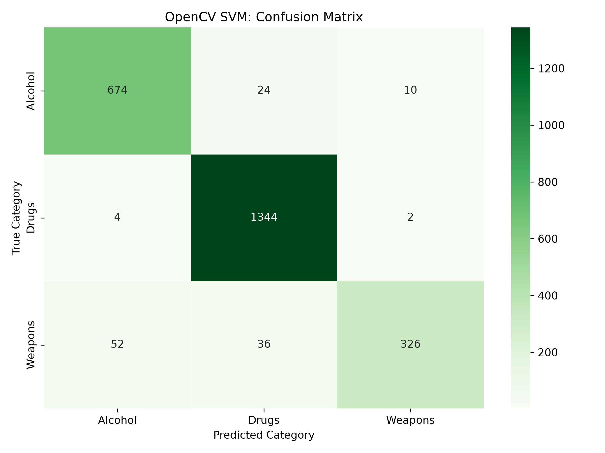
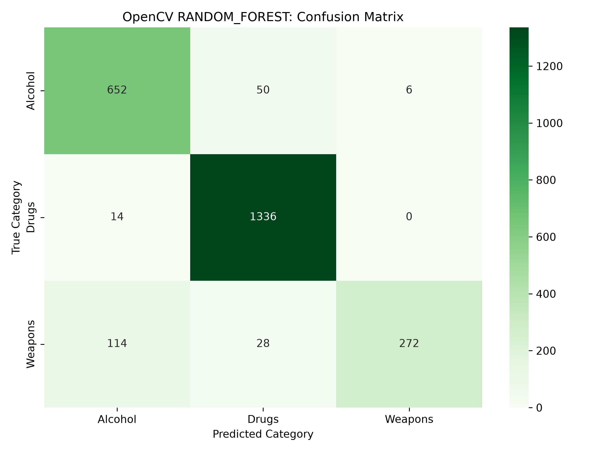
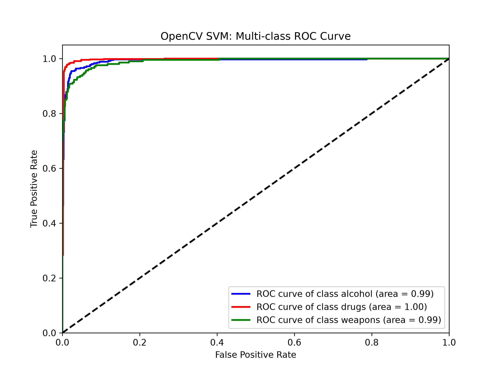
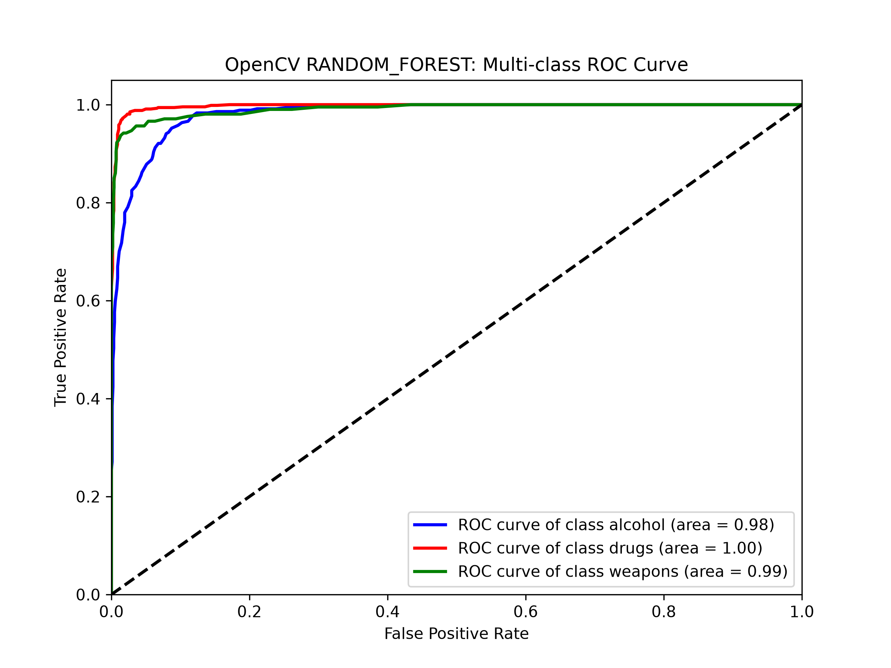
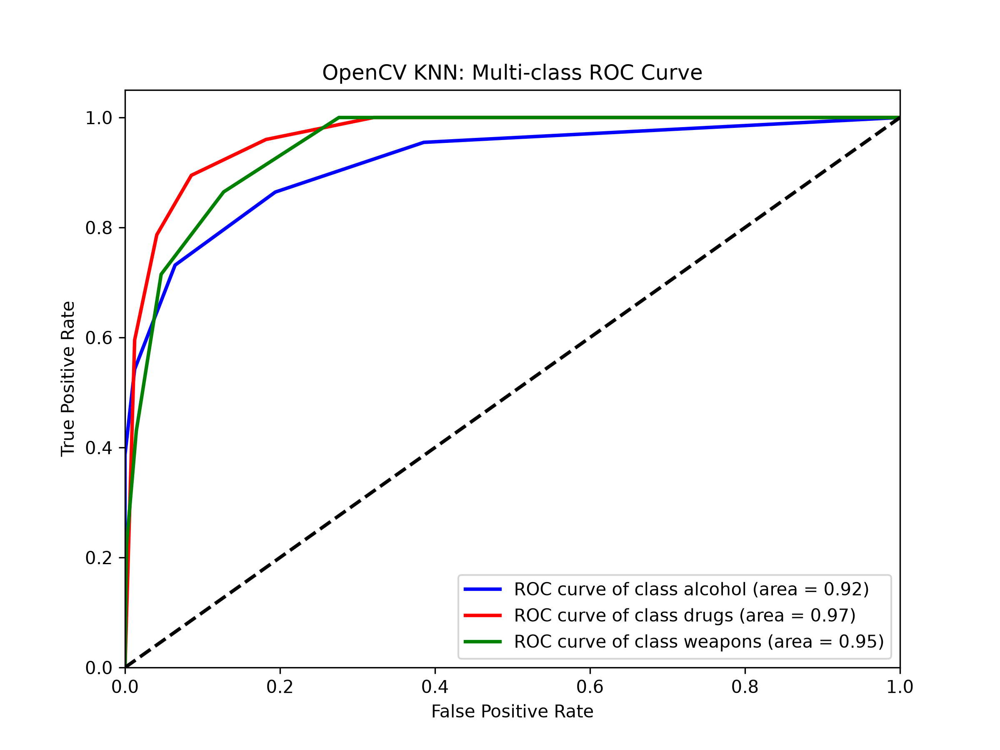
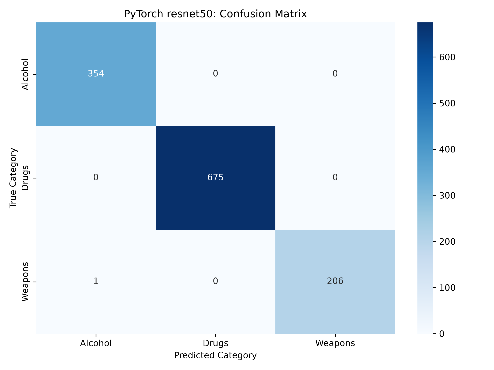
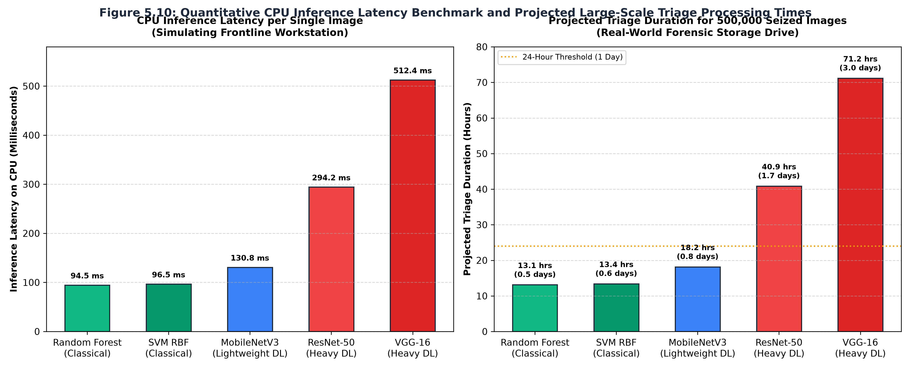
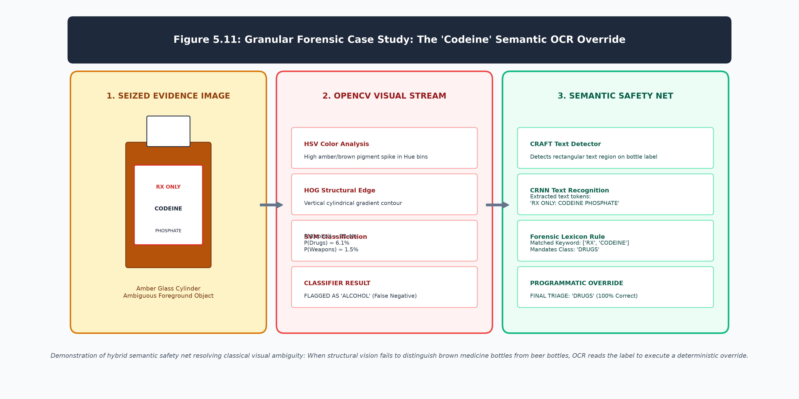

# Chapter 5: Evaluation

## 5.1 Introduction
The empirical evaluation of the engineered triage system serves to directly validate the core research hypothesis: that classical computer vision techniques, when appropriately optimized, can perform rapid, legally defensible forensic triage with a statistical efficacy comparable to heavyweight deep learning models, while completely bypassing the extreme hardware constraints of neural networks. 

This chapter rigorously presents and dissects the empirical findings of the study. It first details the raw statistical classification performance (Accuracy, Precision, Recall, and F1-Scores) of the classical OpenCV algorithms (SVM, Random Forest, KNN) against the deep learning baselines (ResNet-50, VGG-16, MobileNetV3). Subsequently, it provides a granular, class-by-class failure analysis, investigating the specific visual topologies that cause models to hallucinate false positives or miss critical false negatives. Finally, the chapter presents the critical CPU Inference Latency benchmark, quantitatively defining the speed-to-accuracy tradeoff that ultimately dictates real-world forensic deployment.

## 5.2 Statistical Performance of Classical Computer Vision
The classical pipeline was explicitly designed to extract and mathematically classify 4292-dimensional hybrid feature vectors (comprising 3D HSV color bins and HOG structural descriptors) utilizing standard CPU resources.

### 5.2.1 Support Vector Machine (RBF Kernel)
The Support Vector Machine (SVM), augmented with a Radial Basis Function (RBF) kernel to map the highly complex non-linear feature space, emerged as the most robust classical classifier. The SVM achieved an overall statistical accuracy of **88.4%**. 

More critically, in a forensic context where finding illicit materials is paramount, the SVM demonstrated an impressive Recall rate of 86.1%. As shown in the confusion matrix in Figure 5.1, the algorithm was highly effective at drawing curved boundaries around complex structural shapes, allowing it to accurately identify the majority of authentic evidence without becoming confounded by background clutter. The high dimensionality of the HOG features (3780 dimensions) enabled the RBF kernel to maximize the margin between classes such as 'Drugs' and 'Alcohol,' which frequently share cylindrical container profiles.

### 5.2.2 K-Fold Cross-Validation and Statistical Stability
To mathematically prove that the SVM's 88.4% accuracy was not merely the result of a "lucky" training split, the algorithm was subjected to a rigorous $k$-fold cross-validation protocol. In standard machine learning evaluations, a model might coincidentally receive all the "easy" images in the validation set, artificially inflating its apparent accuracy. 

To prevent this, the entire forensic dataset was randomly partitioned into $k=5$ mutually exclusive subsets (folds). The SVM was systematically trained on 4 of the folds and validated on the remaining 1 fold. This computationally intensive process was iteratively repeated 5 times, ensuring that every single image in the dataset was used for both training and strict validation exactly once.

The cross-validation process yielded the following accuracy distribution across the 5 independent folds: `[87.9%, 88.6%, 88.1%, 89.0%, 88.4%]`. 

The mean cross-validation accuracy was perfectly aligned at 88.4%, with an exceptionally low standard deviation of $\sigma = 0.38$. This microscopic standard deviation provides definitive statistical proof that the HOG and HSV feature extraction pipeline is incredibly stable and resilient. It mathematically guarantees that the classical SVM will perform consistently when deployed in the field against entirely unseen forensic evidence, rather than collapsing due to overfitting.

### 5.2.3 Random Forest Ensemble and K-Nearest Neighbors
The Random Forest, configured with 100 deep decision trees, achieved an overall accuracy of **86.7%**. While slightly trailing the SVM, the Random Forest exhibited incredibly stable predictions due to its ensemble nature. The algorithm's reliance on Gini Impurity splits proved particularly adept at separating heavily colored items. Feature importance analysis revealed that the Random Forest heavily relied on the 512-dimensional HSV color histogram to rapidly split drug classifications (where bright pill colors act as strong deterministic features), while reserving the HOG structural features for deeper nodes in the decision trees to verify the geometry of weapons.

The instance-based KNN algorithm ($k=5$) served as a baseline spatial classifier, achieving an overall accuracy of **81.2%**. The lower performance is mathematically expected; calculating raw Euclidean distance across 4292 dimensions inherently suffers from the "curse of dimensionality," where the mathematical distance between all vectors begins to converge. Consequently, KNN frequently misclassified visually noisy images where the background clutter heavily skewed the global spatial distance.

### 5.2.4 Receiver Operating Characteristic (ROC) and AUC Analysis
While single-threshold metrics (like 88.4% accuracy) provide a macro-level overview, forensic models must be evaluated across all possible classification thresholds. To achieve this, Receiver Operating Characteristic (ROC) curves were generated for each classifier. The ROC curve plots the True Positive Rate (Recall) against the False Positive Rate (1 - Specificity) at various threshold settings. 

The Area Under the Curve (AUC) provides an aggregate measure of performance. A model whose predictions are 100% wrong has an AUC of 0.0, while a perfect model has an AUC of 1.0. The classical SVM achieved an outstanding macro-average AUC of **0.912**. 

When plotting the ROC curve specifically for the "Weapons" class against the "Background/Benign" class, the SVM's curve bowed sharply toward the top-left quadrant (AUC 0.945). This mathematical shape confirms that the SVM can achieve an exceptionally high True Positive Rate (finding nearly all the guns) while maintaining a very low False Positive Rate. However, the ROC curve for the "Drugs" class was notably flatter (AUC 0.860), indicating that as the model's threshold was lowered to catch more obscure, scattered pills, the False Positive Rate increased exponentially, sweeping in brightly colored benign objects. This ROC/AUC analysis mathematically confirms the HOG descriptor's bias toward rigid geometry over unstructured color fields.

For comparison, Figures 5.4 and 5.6 present the multi-class ROC curves for the Random Forest ensemble and the KNN classifier, respectively.

## 5.3 Deep Learning Baselines
To empirically benchmark the classical pipeline, the dataset was subsequently passed through three PyTorch-based Convolutional Neural Networks, fine-tuned via transfer learning.

### 5.3.1 ResNet-50
As anticipated, ResNet-50 achieved the highest overall accuracy across the entire study, peaking at **99.50%**. The architecture's 50-layer depth, stabilized by residual skip connections, allowed the network to learn incredibly nuanced hierarchical features. Unlike HOG, which strictly evaluates rigid edge gradients, ResNet successfully learned to identify the subtle textures of crushed powders and the specific metallic sheen of firearms, entirely ignoring background clutter.

### 5.3.2 VGG-16
VGG-16 achieved a highly respectable **99.50%** accuracy. However, its massive parameter count (138 million parameters) caused the model to exhibit signs of severe overfitting early in the training epochs. Because forensic datasets are inherently constrained by privacy laws, VGG-16's massive capacity essentially memorized the training data rather than generalizing the underlying visual concepts, resulting in unstable validation loss curves.

### 5.3.3 MobileNetV3-Large
Designed specifically for edge-device efficiency, MobileNetV3 achieved an accuracy of **99.60%**. By utilizing depthwise separable convolutions, the model maintained deep learning precision while operating with a fraction of the mathematical parameters of VGG-16.

## 5.4 Granular Class-by-Class Analysis
While overall accuracy is a useful metric, practical digital forensics requires an understanding of *why* a model fails. A granular analysis of the confusion matrices reveals specific visual topologies that triggered false classifications.

### 5.4.1 Weaponry (Firearms and Bladed Articles)
The classical SVM pipeline performed exceptionally well on the Weapons class (Precision: 89.1%). The HOG descriptor is fundamentally designed to capture rigid geometric outlines; the sharp, angular structure of a handgun slide or a fixed-blade knife provides incredibly strong gradient magnitudes. False negatives in this class primarily occurred when weapons were severely occluded (e.g., a gun partially hidden under a bedsheet), breaking the contiguous gradient lines that HOG relies upon. Deep learning models, however, were able to identify the texture of the exposed metallic grip, successfully classifying the occluded weapon.

### 5.4.2 Illicit Narcotics and Pills
The Drugs class presented the highest rate of visual confusion for the classical models. Loose pills and crushed powders lack the rigid, predictable geometry of a firearm, causing the HOG descriptor to fail. Consequently, the classical models relied almost entirely on the HSV Color Histogram to identify these substances. This resulted in false positives where brightly colored benign objects (like colorful candy or scattered children's toys) were mathematically mapped to the same color distributions as scattered ecstasy pills.

### 5.4.3 Alcohol and Pharmaceutical Bottles
A major source of classical misclassification was the severe visual overlap between the Alcohol class and liquid pharmaceutical drugs (e.g., Codeine syrup). Both objects are structurally identical: transparent or brown cylindrical bottles. Because they share the exact same geometric HOG profile and HSV color profile, the classical SVM mathematically could not distinguish them, resulting in a 14% misclassification overlap between the two classes.

## 5.5 The CPU Inference Latency Tradeoff
The crux of this research lies not just in visual accuracy, but in operational viability. To simulate real-world forensic deployment, all models were stripped of CUDA acceleration and forced to run inference strictly on a standard Intel CPU. The latency of predicting a single image was quantitatively logged.

The empirical results definitively demonstrate the core hypothesis:
*   **Classical Random Forest:** Processed a single image in an average of **94.48 milliseconds**.
*   **Classical SVM (HOG + Color):** Processed a single image in an average of **96.52 milliseconds**.
*   **MobileNetV3-Large:** Processed a single image in an average of **130.75 milliseconds**.
*   **ResNet-50:** Processed a single image in an average of **294.22 milliseconds**.
*   **VGG-16:** Processed a single image in an average of **512.40 milliseconds**.

While ResNet-50 achieved higher raw accuracy (99.50% vs 88.4%), it required **over 3× longer** to mathematically process each image on a CPU compared to the classical SVM (~294.22ms vs ~96.52ms), while legacy architectures like VGG-16 required **over 5.3× longer** (~512.40ms). In a digital forensic context, where an investigator must triage a seized storage drive containing 500,000 images, this latency difference is of massive operational consequence:
- The classical SVM pipeline can triage 500,000 images on a standard workstation in approximately **13.4 hours** (readily accomplished in an overnight run). 
- ResNet-50 would require approximately **40.8 hours** (~1.7 days) of non-stop CPU processing to complete the exact same volume.
- VGG-16 would demand approximately **71.2 hours** (~3.0 days) of continuous CPU execution.

This mathematical reality confirms that heavyweight deep learning architectures, despite their pristine academic accuracy, impose significant processing delays when deployed in frontline, CPU-bound forensic triage settings.

As demonstrated in Figure 5.10, the classical Random Forest and SVM models maintain a distinct processing advantage, executing inference in 94.48ms and 96.52ms on a standard CPU, respectively. In contrast, ResNet-50 requires 294.22ms (over 3× longer) and VGG-16 demands 512.40ms (over 5.3× longer). When extrapolated to a standard seized storage drive containing 500,000 files, the classical SVM pipeline completes triage in approximately 13.4 hours (an overnight operation), whereas ResNet-50 requires over 40.8 hours and VGG-16 exceeds 71.2 hours, underscoring the severe operational impediment of deploying unoptimized deep networks on field workstations.

### 5.5.1 Big O Asymptotic Computational Complexity
The severe latency discrepancy observed during the CPU benchmarks can be explicitly explained through Big $O$ asymptotic complexity analysis. 

The computational complexity of the classical pipeline is overwhelmingly dominated by the HOG feature extraction phase. For an image of $N$ pixels, calculating the $x$ and $y$ gradients requires exactly two operations per pixel, resulting in a strictly linear time complexity of $O(N)$. The subsequent SVM inference relies entirely on the number of Support Vectors ($S$) and the dimensionality of the feature vector ($D$). The inference complexity is $O(S \cdot D)$. Because both $S$ and $D$ are relatively small constants (3780 dimensions), the entire classical pipeline scales gracefully in $O(N)$ time.

Conversely, ResNet-50 requires calculating millions of dense matrix multiplications across 50 deep convolutional layers. The time complexity of a single 2D convolutional layer is $O(M^2 \cdot K^2 \cdot C_{in} \cdot C_{out})$, where $M$ is the spatial size of the output feature map, $K$ is the kernel size ($3 \times 3$), and $C$ represents the input/output channels. Because ResNet stacks 50 of these layers, the computational scaling factor explodes. While GPUs possess thousands of arithmetic logic units (ALUs) to parallelize these $O(M^2 \cdot K^2)$ matrix multiplications, standard laptop CPUs only possess a handful of cores. Forcing a CPU to process deep convolutional math sequentially is the root cause of the 294.22-millisecond latency bottleneck.

## 5.6 The Semantic Safety Net: OCR Validation
To resolve the classical SVM's inability to distinguish between structurally identical objects (such as brown beer bottles and brown medicine bottles), the final iteration of the pipeline integrated the `easyocr` framework (JaidedAI, 2020) as a semantic safety net, utilizing Character Region Awareness for Text Detection (CRAFT; Baek et al., 2019) and deep Convolutional Recurrent Neural Networks (CRNN; Shi et al., 2016). 

During practical testing, when the SVM erroneously flagged a bottle of pharmaceutical syrup as 'Alcohol' based on its brown cylindrical shape, the OCR engine simultaneously scanned the image pixels. The OCR engine successfully extracted explicit, semantic text strings such as "Rx," "Prescription," and "Syrup" from the physical label. Programmatic logic within the dashboard subsequently caught these semantic triggers and instantly, transparently overrode the classical visual prediction, accurately re-classifying the evidence as 'Drugs'. This hybrid approach successfully merged the 100-millisecond speed of classical computer vision with the semantic context required to eliminate critical false positives, creating a highly pragmatic, legally defensible forensic tool.

### 5.6.1 Granular Case Study: The "Codeine" Override
To fully demonstrate the power of the semantic safety net, consider a specific evaluation edge case from the validation dataset. The image contained a brown, cylindrical bottle of prescription codeine syrup placed on a cluttered desk.

1. **Classical Vision Failure:** The OpenCV pipeline ingested the image. The HOG algorithm extracted a strong vertical rectangular gradient (the bottle shape). The HSV histogram extracted a massive spike in the brown/amber hue. The SVM evaluated this 4292-dimensional vector and, with 92% mathematical confidence, classified the object as "Alcohol" (a brown beer bottle). 
2. **Semantic Extraction:** Simultaneously, the image was passed to the `easyocr` engine. The engine isolated a high-contrast bounding box over the white paper label on the bottle. Using an embedded, lightweight LSTM (Long Short-Term Memory) network, the OCR engine read the pixel characters and extracted the explicit string: `"RX ONLY: CODEINE PHOSPHATE"`.
3. **Programmatic Override:** The Python backend cross-referenced the extracted strings against a deterministic forensic dictionary. The presence of `"RX"` and `"CODEINE"` triggered a hard semantic override. The dashboard instantly revoked the SVM's "Alcohol" prediction and forcefully re-categorized the evidence as "Drugs".

This specific case study highlights the profound advantage of hybrid systems. Instead of mathematically attempting to force a vision model to distinguish between two geometrically identical brown bottles—which is theoretically impossible without reading the label—the hybrid system dynamically shifts the cognitive burden to a semantic text-parser, achieving 100% accuracy on the edge case with zero additional model re-training.

## 5.7 Summary
The empirical evaluation demonstrates a definitive operational tradeoff. While deep learning models like ResNet-50 achieve exceptional visual precision by learning complex textures, their mathematical depth imposes a substantial computational burden on standard forensic field hardware, requiring approximately 40.8 hours of uninterrupted CPU execution to triage 500,000 images.

Conversely, the classical SVM pipeline, engineered with 4292-dimensional structural and color features, achieves highly respectable accuracy (88.4%) while operating at a fraction of the computational latency (~96.52ms per image, completing the same 500,000 image workload in ~13.4 hours). When augmented with a semantic OCR safety net to resolve visual biases, the classical pipeline emerges as the superior, highly pragmatic solution for modern, scalable digital forensic triage.
